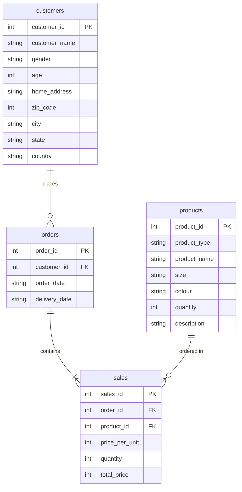

# Ecommerce Data Analytics Dashboard

An interactive, multi-page data analytics dashboard built with Streamlit to explore, analyze, and visualize an Australian Ecommerce dataset. The application provides comprehensive insights ranging from general KPIs to detailed marketing reports, and features an integrated AI-powered Real-Time Voice Assistant to dynamically query the data.

## Features

- **Home:** An overview of the dataset and its columns.
- **Dashboard:** Core KPIs (Total Revenue, Customers, Orders, AOV, Delivery Time) and visualizations analyzing sales, customers, and product preferences.
- **Univariate Analysis:** Interactive exploration of single variables (both numerical and categorical) through histograms and pie charts.
- **Marketing Report:** A filtered view of the data allowing customized queries by target cities and date ranges, revealing top-performing products.
- **Voice Assistant:** An experimental Real-Time Voice Assistant powered by Google Gemini that listens to your questions, dynamically generates and executes Pandas queries on the dataset, and replies with a voice response.

## Database Schema

The analytics are derived from an initial relational database exported as `EcommDB.sql` and subsequently cleaned into a flat file (`cleaned_df.csv`). The original database schema is composed of 4 key tables:



## Tech Stack
- **Framework:** Streamlit
- **Data Manipulation:** Pandas
- **Visualizations:** Plotly Express
- **AI Integration:** Google Gemini Multimodal Live API
- **Styling:** Custom CSS (Glassmorphism), Tailwind CSS

## Setup & Installation

1. **Install Dependencies:**
   Ensure you have Python installed, then install the required libraries:
   ```bash
   pip install -r requirements.txt
   ```

2. **Configure Environment Variables:**
   If using the Voice Assistant, create a `.env` file in the root directory and add your Gemini API Key:
   ```env
   GEMINI_API_KEY=your_api_key_here
   ```

3. **Run the Application:**
   Launch the Streamlit app locally:
   ```bash
   streamlit run Home.py
   ```
